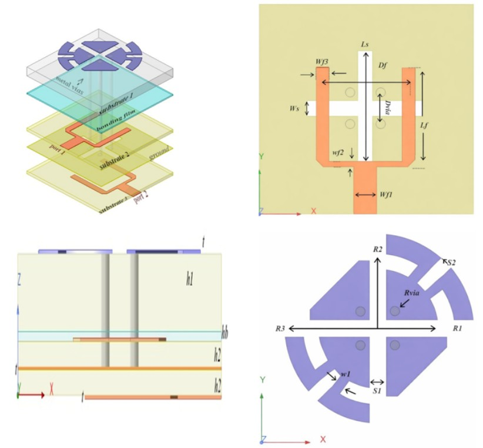
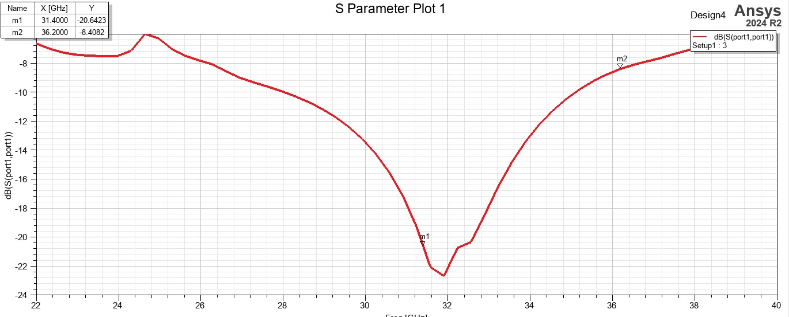
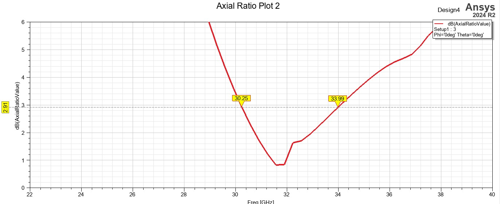
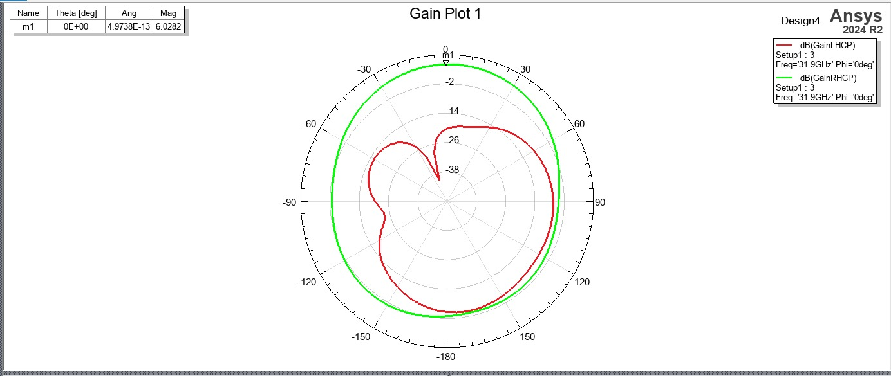
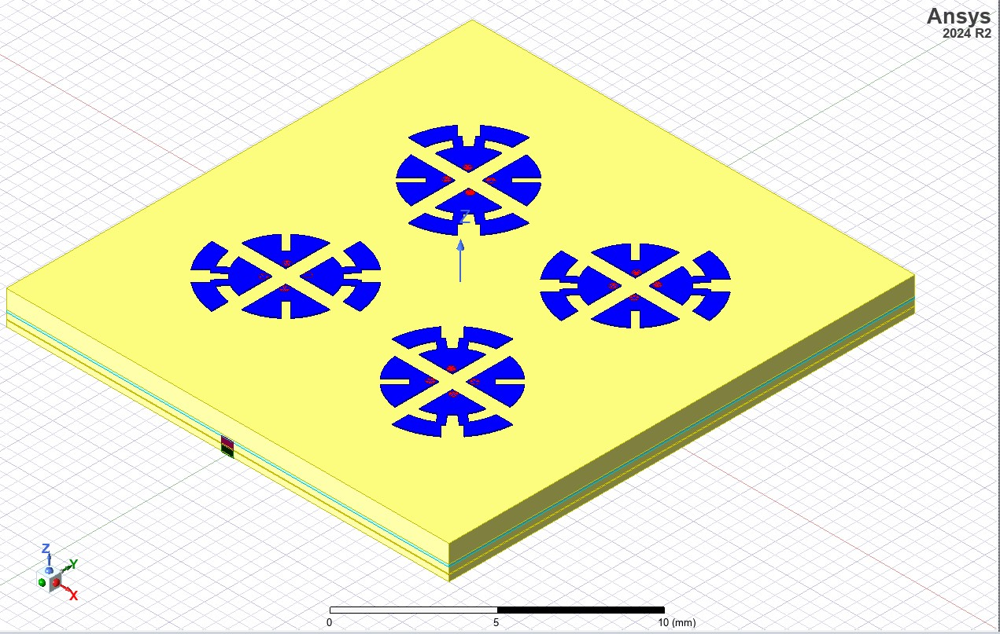
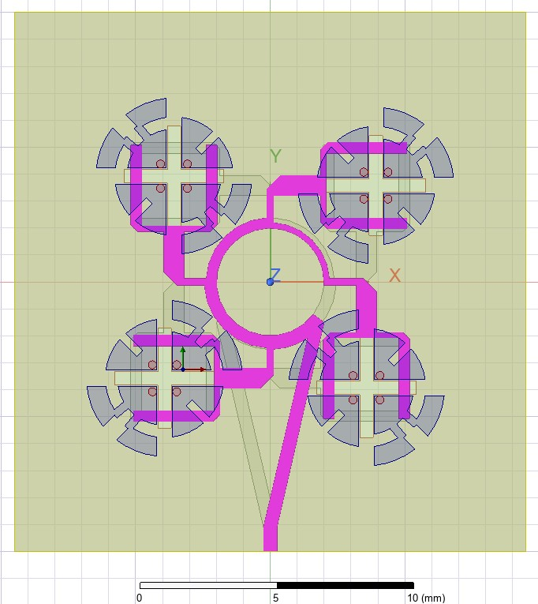

# 📡 Design of Wideband Dual-Circularly Polarized ME Dipole Antenna for V2X Application

🏆 **Best Paper Award** – IEEE SPACE 2026 Conference (Bangalore, India)  
**Affiliation:** Vasavi College of Engineering (Autonomous), Hyderabad  

---

## 📖 Project Overview
This project presents the design, full-wave electromagnetic simulation, and performance validation of a high-performance, wideband dual-circularly polarized (dual-CP) magnetoelectric (ME) dipole antenna engineered for millimeter-wave (mm-Wave) Ka-band Vehicle-to-Everything (V2X) communications. Developed using Ansys HFSS, this architecture successfully mitigates the severe multi-path fading, structural polarization mismatch, and signal degradation standard in high-mobility Intelligent Transportation Systems (ITS) channels.

The design utilizes a low-loss, vertically stacked multilayer substrate configuration consisting of Rogers RT/duroid 5880 layers bonded with an ultra-thin RO4450F film layer. The radiating element comprises four symmetrically positioned quarter-circular patches serving as the electric dipole, coupled with an intermediate cross-slot ground plane functioning as the magnetic dipole. Inductive tuning and precise current return balance are achieved via four shorting vias, while an engineered orthogonal T-shaped feeding network enables independent, simultaneous control over both Left-Hand Circular Polarization (LHCP) and Right-Hand Circular Polarization (RHCP) states.

---

## 📐 Structural Architecture & Geometry

### 3D Isometric Design View
An isometric view highlighting the vertically stacked multilayer geometry, four symmetric quarter-circular radiating patches, inductive shorting vias, cross-shaped slot ground plane, and orthogonal feed matrix.

---

## 📊 Performance Metrics & Simulation Plots

### 1. S-Parameter Reflectance Profile
Simulated reflection coefficient ($S_{11}$) chart validating a continuous impedance matching operational envelope ($S_{11} < -10\text{ dB}$) from **27.8 GHz up to 35.2 GHz**. The plot highlights a deep resonance null down to **-22.6 dB at 31.9 GHz** (Marker m1) and an upper band edge response at **36.2 GHz** (Marker m2).

### 2. Axial Ratio Bandwidth Curve
Polarization purity plot verifying an excellent sub-3 dB circular polarization envelope ($AR < 3\text{ dB}$) stretching from **30.25 GHz to 33.99 GHz** (a 3.74 GHz operational window), dropping down to an exceptional minimal purity floor of **under 0.9 dB** around the 31.8 GHz resonant node.

### 3. Far-Field Radiation Patterns
Gain plot mapping a stable, symmetric broadside radiation envelope computed at **31.9 GHz** ($\Phi = 0^\circ$). The green trace confirms a dominant Right-Hand Circular Polarization (**RHCP peak broadside gain of 6.0282 dBi** at Marker m1) with strong cross-polarization isolation suppressing the Left-Hand Circular Polarization (LHCP, red trace) down past **-25 dB** along the main broadside directional axis.

---

## 🚀 Advanced Array Scaling & Architecture

To scale this topology for actual deployment in rugged, long-range V2X cellular infrastructure, the fundamental element has been expanded into a **$2\times2$ Sequentially Rotated (SR) Antenna Array Subsystem**. This layout uses a center-fed microstrip corporate distribution network providing progressive phase distributions ($0^\circ, 90^\circ, 180^\circ, 270^\circ$) to substantially flatten axial ratio behavior and elevate spatial isolation across the entire operating frequency spectrum.

### 1. 3D Isometric View of the $2\times2$ Subarray Structure
The scaled $2\times2$ subarray layout showcasing the distribution configuration of individual elements across the common multi-layer ground and bonding structure.

### 2. Top-Down Layout and Corporate Distribution Feed Network
Detailed top-down layout illustrating the specialized microstrip ring distribution routing lines engineered to provide wideband phase tracking and precise port feeding impedance calibration.

---

## 🔮 Future Scope & Efficiency Optimization via Phased Arrays

The next evolutionary iteration of this design involves migrating the passive $2\times2$ subarray architecture into an **Active Electronically Scanned Phased Array (AESA)** system. This transformation directly addresses key efficiency, range, and latency challenges in complex vehicular environments:

* **Dynamic Beamforming & Real-Time Tracking:** Implementing active phase shifters behind each element permits precise, programmable steering of the main radiation lobe. This ensures continuous, low-latency connectivity between high-speed autonomous vehicles and fixed Roadside Units (RSUs), bypassing link dropouts caused by vehicular motion or structural blockage.
* **Overcoming High mm-Wave Path Loss:** Signal attenuation scales sharply at Ka-band frequencies. Integrating this configuration into a larger multi-element phased array scales directional directivity and concentrates radiated power into sharp, narrow beams. This substantially expands total communication range without spiking basic input power demands.
* **Maximizing Power Efficiency & Thermal Thresholds:** Passive corporate feeding networks inherently experience dielectric insertion losses as the system scales up. Shifting to an active phased array layout utilizing discrete, localized Transmit/Receive (T/R) RF amplifiers minimizes input path dissipation, maximizing overall radiation efficiency and safeguarding optimal thermal performance under heavy operational cycles.
* **Spatial Multiplexing & Polarization Diversity:** An active phased array grid can split resources to track multiple targets simultaneously on distinct beams, providing massive throughput boosts to dense urban V2X nodes.

---

## 🛠️ Technical Specifications
* **Simulation Suite:** Ansys HFSS 2024 R2 (Finite Element Method solver)
* **Operational Band:** mm-Wave Ka-Band (Targeting 5G/6G V2X Infrastructure)
* **Substrate Materials:** Rogers RT/duroid 5880 ($\varepsilon_r = 2.2, \tan \delta = 0.0009$), Rogers RO4450F bonding film ($\varepsilon_r = 3.52$)
* **Antenna Footprint:** Compact $7\text{ mm} \times 6.75\text{ mm} \times 1.176\text{ mm}$ physical profile (Single Element)
